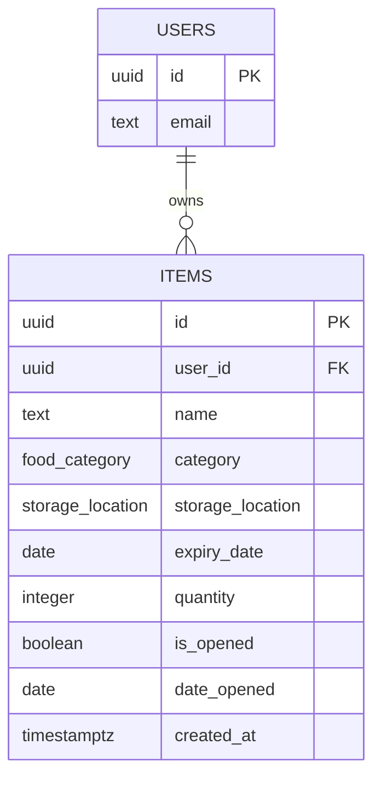

# ExpiryMate

**Track what's in your kitchen. Waste less. Eat it before it's gone.**

ExpiryMate is a web application that helps households keep track of food items and their expiry dates. Users log what they have — name, category, storage location, printed expiry date, quantity, and whether it's been opened — and the app calculates an **adjusted expiry date** from USDA cold-storage guidance, factoring in how the item is actually stored and whether it's been opened. Items approaching or past their adjusted expiry date are flagged with a status badge and surfaced through an in-app banner and a browser notification, so nothing gets pushed to the back of the fridge and forgotten.

[](https://react.dev)
[](https://www.typescriptlang.org)
[](https://vite.dev)
[](https://supabase.com)
[]()

**Live app:** [expiry-mate.vercel.app](https://expiry-mate.vercel.app)
**Course context:** Year 12 Software Engineering, Assessment Task 3 (Software Engineering Project) — Emanuel School.

---

## Contents

- [Why this exists](#why-this-exists)
- [Features](#features)
- [Tech stack](#tech-stack)
- [Getting started](#getting-started)
- [Available scripts](#available-scripts)
- [Environment variables](#environment-variables)
- [Project structure](#project-structure)
- [The adjusted expiry algorithm](#the-adjusted-expiry-algorithm)
- [Database schema](#database-schema)
- [Security](#security)
- [Testing](#testing)
- [Documentation](#documentation)
- [Project status](#project-status)
- [Use of AI in this project](#use-of-ai-in-this-project)

---

## Why this exists

Roughly a third of all food produced for human consumption is lost or wasted, and a large share of that happens inside ordinary households — food goes off before anyone gets around to using it. The usual workarounds don't scale: putting things at the front of the fridge only helps until the front fills up, and a note on paper or in a notes app is easy to forget and never actively reminds anyone of anything.

ExpiryMate replaces both with a system that actively tracks every item a household logs and tells the user when something needs attention, rather than relying on them to remember. See [`docs/01-problem-statement.md`](docs/01-problem-statement.md) for the full background and [`docs/02-requirements.md`](docs/02-requirements.md) for the requirements this design is built against.

## Features

- **Per-user accounts** — email/password sign-up and sign-in via Supabase Auth, with each user's items fully isolated from every other user's via Row Level Security.
- **Full item schema** — name, category (11 types), storage location (Fridge / Freezer / Pantry), printed expiry date, quantity, opened status, and date opened, with a category guessed automatically from the item's name as it's typed (fully overridable).
- **Adjusted expiry dates** — every item's real shelf life is computed from its category, storage location, and opened status against a USDA-sourced rule table, not just the printed date on the label. Unsafe combinations (e.g. raw meat left in the pantry) are flagged as a warning instead of a date.
- **Status at a glance** — Fresh / Expiring Soon / Expired badges and a live days-remaining countdown, derived from the adjusted date.
- **Expiry notifications** — a single batched browser notification on load for anything within 7 days of its adjusted expiry date, backed by an always-visible in-app banner as a fallback for when notifications are denied or blocked.
- **Search, filter, and sort** — filter the dashboard by storage location, category, or status, search by name, and group cards either by storage location or by expiry status, with unsafe items always pinned to their own section at the top.
- **Click-to-expand cards** — a minimal collapsed view (countdown, status, name, category icon) that expands to a full detail view with a "grows from where you clicked" animation, built without any animation library.
- **Dark mode** — a manual light/dark toggle, persisted across sessions, with no flash of the wrong theme on load.
- **Delete confirmation** — deleting an item requires an explicit in-place confirmation step; nothing is removed on a single click.

## Tech stack

| Layer | Technology |
|---|---|
| Frontend | React 19, TypeScript 6, Vite 8 |
| Backend / database | Supabase (PostgreSQL, Auth, Row Level Security) |
| Hosting | Vercel — auto-deploys from `main` |
| Styling | Plain CSS — no UI library, no external fonts |
| Tooling | ESLint, `tsc` |

No component library, animation library, or CSS framework is used anywhere in the project — every visual element, including the icons, is hand-written. This was a deliberate scope decision; see [`docs/decisions.md`](docs/decisions.md) for the reasoning.

## Getting started

```bash
git clone <this repository>
cd ExpiryMate
npm install
npm run dev
```

The dev server starts on `http://localhost:5173` by default. You'll need a `.env.local` file in the project root before the app can talk to Supabase — see [Environment variables](#environment-variables) below.

## Available scripts

| Command | What it does |
|---|---|
| `npm run dev` | Start the Vite development server with hot reload |
| `npm run build` | Type-check the whole project with `tsc`, then build for production |
| `npm run lint` | Run ESLint across the codebase |
| `npm run preview` | Serve a production build locally, for a final check before deploying |

## Environment variables

Create a `.env.local` file in the project root (it's git-ignored and never committed):

```env
VITE_SUPABASE_URL=<your Supabase project URL>
VITE_SUPABASE_ANON_KEY=<your Supabase anon/publishable key>
```

Both values are visible in your Supabase project's dashboard under **Settings → API**. The anon key is safe to expose client-side — it carries no privileges beyond whatever Row Level Security grants — but a **service-role key must never be placed here or anywhere in client code**.

## Project structure

```
ExpiryMate/
├── README.md                        this file
├── CLAUDE.md                        project memory: structure, key components, current status
├── docs/                            the folio — planning, decisions, and evidence
│   ├── 01-problem-statement.md      need, opportunity, scope
│   ├── 02-requirements.md           functional and non-functional requirements
│   ├── 03-architecture.md           system design notes
│   ├── 04-data-model.md             schema, ERD, relationships
│   ├── 05-security-review.md        threat model, RLS reasoning, defences
│   ├── 06-front-end-architecture.md component tree, data flow, styling approach
│   ├── 07-evaluation.md             evaluation plan and findings
│   ├── 08-test-plan.md              test layers and coverage priorities
│   ├── 09-iteration-log.md          UAT feedback and deployment iteration, entry per revision
│   ├── decisions.md                 every design/architecture decision and its reasoning, incl. the build slice plan and the algorithm spec
│   └── ai-use-log.md                every substantive AI interaction — prompt, response, and what was accepted
├── src/
│   ├── App.tsx                      session shell: Auth vs. the authenticated dashboard
│   ├── main.tsx                     React entry point
│   ├── index.css / App.css          global styles and layout — no UI library
│   ├── components/                  Auth, AddItemForm, ItemList, AnimatedModal, ExpiryBanner
│   ├── hooks/                       useItems, useTheme, useAnimatedModal, useExpiryNotifications
│   └── lib/                         Supabase client, the adjusted-expiry algorithm, validation, category guessing
├── supabase/
│   ├── migrations/                  schema history, applied in order
│   └── functions/                   reserved for a possible future email-digest edge function
└── tests/
    ├── unit/                        pure logic (adjusted-expiry, status calculation)
    ├── integration/                 tests against a real Supabase schema (RLS, constraints)
    └── smoke/                       manual post-deploy checklist
```

## The adjusted expiry algorithm

The printed date on a food label assumes it stays in its intended storage. ExpiryMate doesn't take that printed date at face value — `src/lib/adjustedExpiry.ts` computes a real, adjusted expiry date from four inputs: **food category**, **storage location**, **opened status**, and, if opened, the **date it was opened**. The rule table behind this (one rule set per category, sourced from USDA cold-storage guidance) lives in [`docs/decisions.md`](docs/decisions.md), under "Adjusted Expiry Date Algorithm".

Combinations that are genuinely unsafe — raw meat left in the pantry, for example — don't get an adjusted date at all. They're flagged as a warning instead, and warned items are always pinned to their own section at the top of the dashboard regardless of how the rest of the list is sorted.

Everything downstream — the days-remaining countdown, the Fresh / Expiring Soon / Expired badge, and the 7-day expiry notification — is derived from this adjusted date, never from the printed one.

## Database schema

ExpiryMate has a single application table, `items`, owned per-user via a foreign key to Supabase's built-in `auth.users` table — there's no separate `users` table, since Supabase Auth is the sole source of truth for identity. `category` and `storage_location` are Postgres enums, so invalid values are rejected at the database level even if the client is bypassed.



Full column-level detail, constraints, and migration history: [`docs/04-data-model.md`](docs/04-data-model.md).

## Security

- **Authentication** via Supabase Auth (email/password, email verification enabled) — no custom credential handling anywhere in this codebase.
- **Row Level Security** on `items`, split into four per-operation policies (select/insert/update/delete), each enforcing `auth.uid() = user_id` at the database level — not just in application code.
- **No service-role key** ships client-side; only the public anon key, which carries no privileges beyond what RLS grants.
- **No plaintext secrets** — the only sensitive data is auth credentials, which Supabase Auth stores hashed and never exposes to this codebase.
- **Parameterised queries** throughout via `supabase-js`; no raw SQL string concatenation anywhere in the app.
- **XSS** is closed off by React's default JSX escaping — user-entered text (e.g. an item name) is never rendered via `dangerouslySetInnerHTML`.

Full threat model and the security-floor checklist: [`docs/05-security-review.md`](docs/05-security-review.md).

## Testing

`tests/unit/`, `tests/integration/`, and `tests/smoke/` are laid out and ready, with coverage priorities defined in [`docs/08-test-plan.md`](docs/08-test-plan.md) — pure-function unit tests for the adjusted-expiry algorithm and status thresholds first, since they're the algorithmic core and the easiest place to introduce a subtle off-by-one bug; RLS and constraint integration tests against a real Supabase schema second; a manual smoke checklist against the live deployment last. Every pure function in `src/lib/` (`adjustedExpiry.ts`, `itemStatus.ts`, `guessCategory.ts`, `validateItem.ts`) was written with no React or Supabase dependency specifically so it's easy to test in isolation once test-writing starts.

Every change in this repository is checked with `npx tsc -b --force` (type-check) and `npx eslint .` (lint) before being committed — see [`docs/ai-use-log.md`](docs/ai-use-log.md) for where this verification is recorded per change.

## Documentation

| Document | Covers |
|---|---|
| [`docs/01-problem-statement.md`](docs/01-problem-statement.md) | The problem, affected users, and why existing workarounds fall short |
| [`docs/02-requirements.md`](docs/02-requirements.md) | Must Have / Nice to Have / Out of Scope requirements |
| [`docs/03-architecture.md`](docs/03-architecture.md) | System design notes |
| [`docs/04-data-model.md`](docs/04-data-model.md) | Schema, ERD, relationships, migration history |
| [`docs/05-security-review.md`](docs/05-security-review.md) | Threat model and the security-floor checklist |
| [`docs/06-front-end-architecture.md`](docs/06-front-end-architecture.md) | Component tree, data flow, styling approach, accessibility |
| [`docs/07-evaluation.md`](docs/07-evaluation.md) | Evaluation plan and findings |
| [`docs/08-test-plan.md`](docs/08-test-plan.md) | Test layers, tooling, and coverage priorities |
| [`docs/09-iteration-log.md`](docs/09-iteration-log.md) | A dated entry per revision — what changed and why |
| [`docs/decisions.md`](docs/decisions.md) | Every design/architecture decision, the build slice plan, and the full adjusted-expiry algorithm spec |
| [`docs/ai-use-log.md`](docs/ai-use-log.md) | Every substantive AI interaction: prompt, response, and what was accepted |
| [`CLAUDE.md`](CLAUDE.md) | A single up-to-date snapshot of the project — structure, key components, and current status |

> **Note on `docs/03-architecture.md`, `06-front-end-architecture.md`, `07-evaluation.md`, and `08-test-plan.md`:** these were written early, before Slice 1 landed, and describe an earlier, pre-implementation state of the app in places. `CLAUDE.md` and `decisions.md` are kept current with every change and are the reliable source of truth for where the project actually stands; the four files above are worth a pass to bring in line before submission.

## Project status

All six planned build slices have landed code, in order:

1. ✅ **App Shell** — auth, per-user data isolation. Fully verified end-to-end against the live Supabase project.
2. ✅ **Full Schema Forms** — every item field, add/edit/delete. Code-complete.
3. ✅ **Adjusted Expiry Logic** — the full algorithm across all 11 categories. Fully verified, including a live browser test.
4. ✅ **Styling** — no UI library, dark mode, responsive layout, click-to-expand cards, search/filter/sort, delete confirmation, category icons. Code-complete.
5. ✅ **Expiry Notifications** — batched browser notification plus an in-app banner fallback. Code-complete.
6. 🟡 **Nice-to-Haves** — auto-category suggestion and defaulting the date field to today are done; AI recipe suggestions and multi-user household sharing are deliberately deferred, not dropped.

All Must Have requirements from `docs/02-requirements.md` are code-complete. The one thing genuinely outstanding across every slice above is a real browser walk-through — this project has been built and verified with `tsc`/`eslint` throughout, but not yet clicked through in an actual browser. See [`CLAUDE.md`](CLAUDE.md) for the detailed, currently-accurate breakdown of what's done, what's outstanding, and why.

## Use of AI in this project

This project was built with substantial assistance from Claude, used as a coding and design-decision partner throughout. Every substantive interaction — what was asked, what Claude produced, and whether it was accepted, modified, or rejected — is logged in [`docs/ai-use-log.md`](docs/ai-use-log.md), per the assessment's AI use disclosure requirements. Design and architecture decisions, including the reasoning behind them, are recorded separately in [`docs/decisions.md`](docs/decisions.md).
