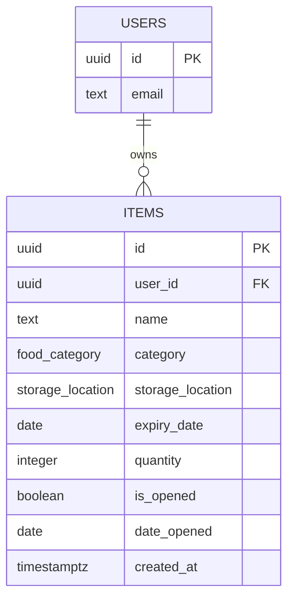

# Data Model

## Overview

ExpiryMate has a single application table, `items`, owned per-user via a foreign key to Supabase's built-in `auth.users` table. There is no separate `users` or `profiles` table: Supabase Auth is the source of truth for identity, and every row in `items` is scoped to exactly one `auth.users.id`.

Two Postgres enums constrain the categorical fields (`food_category`, `storage_location`) so invalid values are rejected at the database level rather than relying on the front end alone.

## Entity Relationship Diagram

`USERS` is Supabase's managed `auth.users` table; ExpiryMate never writes to it directly. `ITEMS` is the one table this project owns.

## Table: `items`

| Column | Type | Constraints | Notes |
|---|---|---|---|
| `id` | `uuid` | PK, `default gen_random_uuid()` | Surrogate key |
| `user_id` | `uuid` | FK → `auth.users(id)`, `on delete cascade`, `not null` | Row ownership; deleting a user removes their items |
| `name` | `text` | `not null` | Free-text item name (e.g. "Milk") |
| `category` | `food_category` (enum) | `not null`, default `'Produce'` | Dairy / Meat / Seafood / Produce / Bakery / Frozen / Beverages / Condiments / Snacks / Leftovers |
| `storage_location` | `storage_location` (enum) | `not null`, default `'Fridge'` | Fridge / Freezer / Pantry |
| `expiry_date` | `date` | `not null` | Printed expiry date from the label |
| `quantity` | `integer` | `not null`, `check (quantity between 1 and 999)` | Defaults to 1 |
| `is_opened` | `boolean` | `not null`, default `false` | Whether the item has been opened |
| `date_opened` | `date` | `check (date_opened <= current_date)` | Required when `is_opened = true` (enforced by a separate table-level check constraint) |
| `created_at` | `timestamptz` | default `now()` | Row creation timestamp |

### Constraints beyond column-level checks

- `date_opened_required_when_opened`: `check (is_opened = false or date_opened is not null)`. This means a row can't claim to be opened without recording when — the adjusted-expiry algorithm (see `decisions.md`) depends on this being true.
- `quantity` is bounded to 1–999 to keep the field meaningful (a quantity of 0 or a negative number isn't a real inventory state).

### Why one table, not several

Category and storage location were modelled as Postgres enums on the `items` row rather than as separate lookup tables (e.g. `categories`, `storage_locations`) because the value sets are small, fixed by the requirements document, and don't carry their own attributes beyond a label. A lookup table would add a join for no real benefit at this scale. If the "nice to have" household-sharing feature is ever built, that would introduce a `households` table and a join table between `households` and `auth.users` — deliberately deferred until Slices 1–5 are solid (see `04-slice-structure` content folded into `decisions.md`).

## Relationships

- `items.user_id → auth.users.id`, one-to-many: one user has many items, each item belongs to exactly one user.
- No item-to-item relationships exist yet. The adjusted expiry date is computed at read time from an item's own columns (see `05-security-review.md` and `decisions.md` for why it isn't persisted).

## Migrations

| File | Purpose |
|---|---|
| `supabase/migrations/20260507000000_create_items.sql` | Creates `items` with `id`, `user_id`, `name`, `expiry_date`, `created_at`, enables RLS, adds the base ownership policy |
| `supabase/migrations/20260601000000_add_item_fields.sql` | Adds the `food_category` and `storage_location` enums, and the `category`, `storage_location`, `quantity`, `is_opened`, `date_opened` columns with their constraints |
| `supabase/migrations/seed.sql` | Seeds ~20 representative household items across all categories for local testing, including one expired item to exercise the status-badge logic |

Future schema changes (e.g. a `households` table) will be added as new timestamped migration files rather than editing existing ones, so the migration history stays a reliable audit trail of how the schema evolved.
